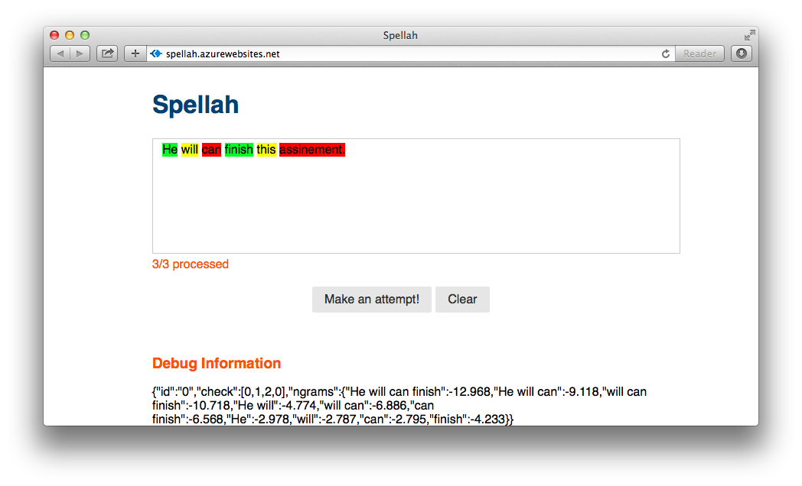

Spellah
=======

Spellah is a cloud-based spell checking mashup that uses the Microsoft's Web Language Model API. It is developed by Dmitry Ustalov and Igor Lashkov at the [Microsoft Research Summer School](http://web.archive.org/web/20140328010258/http://cloud2014.cs.msu.ru/en) (2014) in Moscow, Russia.

Spellah has been awarded with the [best overall solution](https://www.microsoft.com/en-us/research/blog/summer-school-in-russia-explores-research-in-the-cloud/) award at the hackathon organized during the school. Since the underlying Web Language Model API seems to be not available anymore, this source code is provided only for archival purposes.



## Proposal

> Our project—Spellah—is a spell checking mashup based on n-gram statistics obtained from the search engines. When the phrase frequency is high, it is considered as correctly spelled. Otherwise, if the frequency is low and the phrase is potentially misspelled, the system tries to locate and highlight the mistake by employing the joint n-gram probabilities. Our primary data provider is the Microsoft Web N-Gram service, which has been kindly made available for us by Microsoft Research. Spellah is crafted using such modern Web technologies as Node.js and HTML5, and is deployed on Windows Azure utilizing its advanced features as GitHub integration, Redis cache, etc.

## API

Spellah provides an application programming interface which allows one to interact with it using HTTP. To check the spelling of a phrase, it is necessary to send the phrase to Spellah as a GET request.

```bash
curl 'http://<ENDPOINT>/check?q=remember+when+ya+were'
```

The default API format is JSON. The resulted JSON object contains two properties: `check` and `ngrams`.

```json
{"check":[0,0,2,1],"ngrams":{"remember when ya were":-12.499,"remember when ya":-9.831,"when ya were":-9.888,"remember when":-5.705,"when ya":-7.26,"ya were":-8.374,"remember":-3.896,"when":-3.004,"ya":-4.647,"were":-3.161}}
```

The first one is an array with error levels for each consequent token. In the given example the levels are `0` both for words *remember* and *when*, `2` for the word *ya*, and `1` for the word *were*. The higher is number, the more likely is the word to be misspelled. The second property represents n-grams' log-probabilities obtained from the Microsoft Web N-Gram service.

## Configuration

The following environment variables affect the behavior of Spellah:

* `REDIS_HOST` is the hostname of the Redis cache,
* `REDIS_KEY` is the authentication key for it,
* `REDIS_DISABLED` forbids Spellah to use Redis despite of its configuration,
* `SUBSCRIPTION_KEY` is the Microsoft [Cognitive Services](https://www.microsoft.com/cognitive-services/en-us/) Web Language Model API key.

## Acknowledgements

* [Dennis Gannon](http://research.microsoft.com/en-us/people/degannon/), [Sergey Berezin](http://cs.msu.ru/persons/238), and the rest of the school's staff for the fruitful discussions.
* [Microsoft Web N-Gram Service](http://web.archive.org/web/20140721042149/http://weblm.research.microsoft.com/) team, who has provided an API key for the original version of Spellah.
